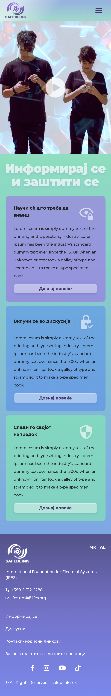
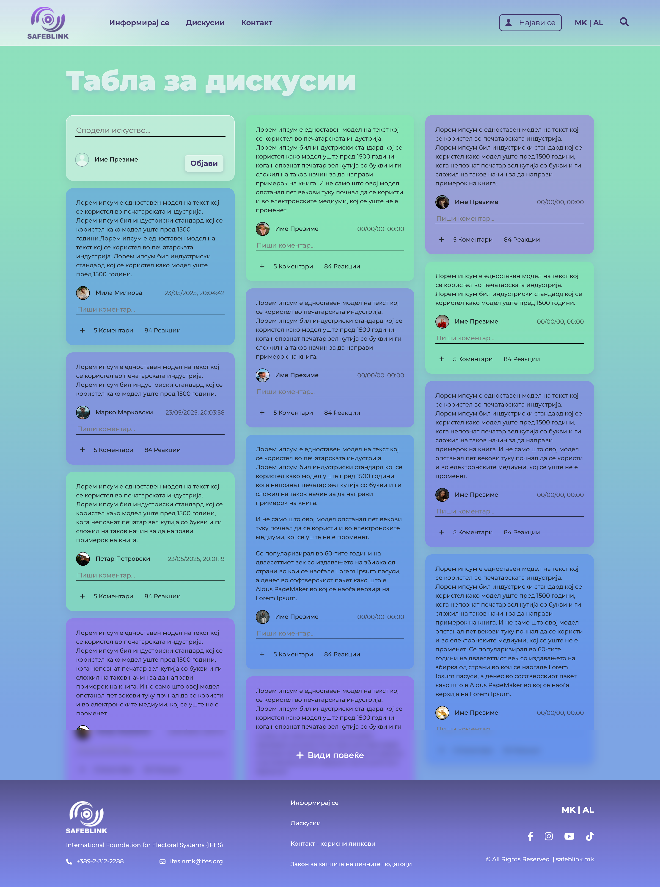
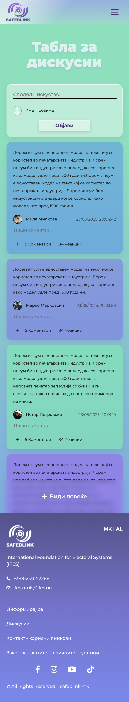
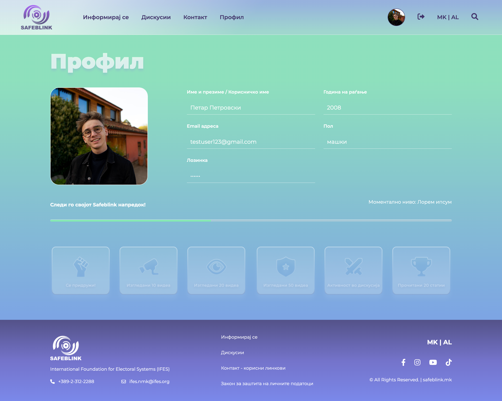

# SafeBlink - Educational Web Application

This web application serves as an educational platform that helps users understand and implement safe web practices. It provides interactive content, articles, and resources to guide users through various aspects of web security and safe internet usage.

## Overwiew

- Single-page application (SPA) behavior using hash-based routing
- Modular JavaScript function handling
- REST API used for handling user authentication
- Responsive layout using CSS
- Reusable HTML templates

## Features

- **User Authentication System**
  - Login/logout functionality
  - User profile management
  - Personalized user experience
- **Interactive Content**
  - Educational articles and resources
  - Video content integration
  - Interactive discussion board
- **Responsive Design**
  - Mobile-friendly responsive style
  - Responsive layout for desktop and laptops
  - Modern and intuitive user interface
- **Content Categories**
  - Most viewed content
  - Current topics
  - Latest updates
  - Filterable content sections

## Technologies Used

### Frontend

- HTML5
- CSS3
- Vanilla JavaScript
- Bootstrap 5

### Backend

- Python
- Flask (REST API)
- User Authentication System

## Project Structure

```
├── images/                     # Image assets used in the project
├── js/                         # JavaScript files
├── templates/                  # HTML templates
├── REST-API/                   # Backend Python files (e.g., Flask app)
│   └── authenticator.py        # Main backend application file
├── styles.css                  # Main stylesheet
├── index.html                  # Main HTML file
└── README.md                   # Project documentation
```

## Key Functionalities

1. **User Authentication**
   - User authentication system
   - Session handling
2. **Content Management**
   - Dynamic content loading
   - Category-based filtering
   - Interactive cards system
3. **Interactive Features**
   - Discussion board
   - Video integration
   - Content overlay system
     

## Project Screenshots

### Landing Page


### Landing Page Mobile



### Informiraj se Page


### Informiraj se Page Mobile


### Diskusii Page



### Diskusii Page Mobile



### Profile Page



### Profile Page Mobile


## Credits

- **Design**: Provided by Brainster
- **Icons**:
  - From provided Figma Design
  - Font Awesome
